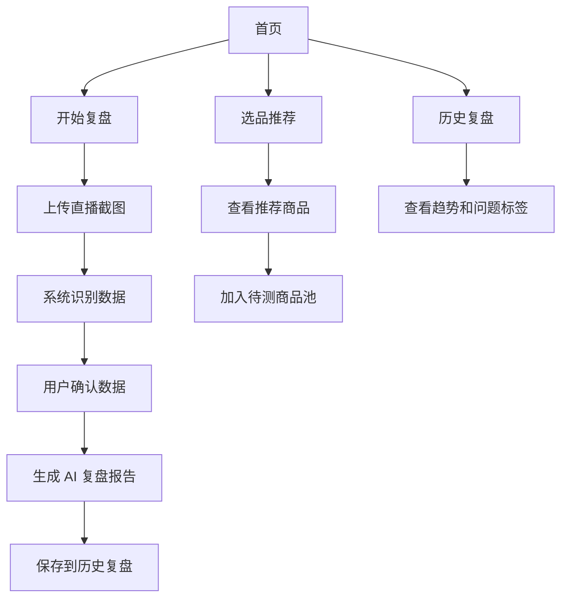

# LiveIQ 一人团队直播复盘 App PRD

## 1. 产品基本信息

### 1.1 产品名称
LiveIQ

### 1.2 产品形态
移动端 App 为主，后续支持 Web 运营后台。

### 1.3 产品版本
V1.0 PRD

### 1.4 产品一句话描述
帮助一人团队直播带货主播，从选品到复盘，全程有数据支撑，并把平台数字转化为可执行策略。

## 2. 项目背景

当前直播和短视频带货领域中，个人主播和一人团队越来越多，但大多数人存在以下问题：

- 平台后台提供大量数据，但用户不知道哪些指标重要，更不知道问题出在哪里。
- 复盘主要依靠经验和感觉，无法形成稳定的优化闭环。
- 选品常常依赖主观判断，容易错过正在起量但尚未爆发的潜力商品。
- 市面上的数据平台更擅长“给数字”，但无法直接输出“可执行的内容策略和行动建议”。

因此，需要一款以“一人团队直播复盘”为核心的 AI 数据产品，帮助用户完成：

- 下播后快速诊断本场直播表现
- 输出明天可执行的行动建议
- 基于历史复盘和市场趋势辅助选品
- 建立个人直播数据资产，持续优化内容与成交表现

## 3. 产品目标

### 3.1 业务目标

- 打造面向一人团队主播的轻量型数据策略工具
- 让用户在 10 分钟内完成一次有效复盘
- 通过 AI 诊断替代人工分析，降低使用门槛
- 构建“复盘数据资产 + 市场趋势 + 选品推荐”的增长闭环

### 3.2 用户目标

- 看懂直播后台关键数据
- 快速知道本场直播的亮点和问题
- 获得第二天可以直接执行的优化建议
- 更早发现潜力商品，减少凭感觉选品

## 4. 目标用户

### 4.1 核心用户

| 维度 | 一人直播带货主播 |
| --- | --- |
| 场次频率 | 每周 3 场以上 |
| 粉丝规模 | 1 万 ~ 50 万 |
| 技术能力 | 手机操作熟练，但不懂数据分析 |
| 核心痛点 | 看不懂后台数据，不知道问题在哪；选品靠感觉，爆品发现太晚 |

### 4.2 延展用户

- 一人短视频带货达人
- 小型直播工作室
- MCN 运营人员
- 品牌市场团队中的内容投放和达人合作岗位

### 4.3 用户画像关键词

- 时间有限
- 不擅长复杂表格和数据分析
- 更愿意上传截图而不是手工录入
- 更关注“明天怎么改”，而不是“今天发生了什么”

## 5. 核心价值

### 5.1 对用户的价值

- 把直播后台复杂数据翻译成易读、可执行的策略报告
- 帮用户定位问题，而不是只展示数字
- 帮用户发现潜力商品，而不是只追逐已经爆掉的爆品
- 让复盘沉淀为可复用的数据资产

### 5.2 产品差异化亮点

- 数据截图即可开始复盘，降低使用门槛
- AI 自动诊断“问题-原因-建议”完整链路
- 从历史复盘结果反推选品方向，而不是单纯做趋势榜单
- 解决“数据平台只给数字、看不出策略”的痛点

## 6. 核心功能设计

### 6.1 功能总览

V1 重点围绕两个核心模块展开：

- 直播复盘
- 选品推荐

支撑能力包括：

- 数据截图上传与识别
- 核心指标解析
- AI 结构化分析
- 历史复盘数据资产沉淀

### 6.2 模块一：直播复盘

#### 6.2.1 功能目标

主播下播后上传直播后台截图，系统自动提取关键数据并生成诊断报告。

#### 6.2.2 用户操作流程

1. 用户进入“新建复盘”
2. 上传直播后台截图
3. 系统 OCR 识别和结构化抽取关键指标
4. AI 自动生成复盘报告
5. 用户查看问题、亮点和明日建议
6. 复盘结果自动归档，形成历史记录

#### 6.2.3 输入数据

- 直播数据截图
- 直播基本信息
  - 直播标题
  - 日期
  - 时长
  - 平台
- 可选补充信息
  - 主推商品
  - 优惠机制
  - 本场目标

#### 6.2.4 分析核心指标

重点分析以下流量指标：

- 场观人数
- 实时在线人数
- 实时在线曲线
- 在线峰值
- 平均停留时长
- 流量来源结构
  - 推荐
  - 粉丝
  - 搜索

后续可扩展指标：

- 点击率
- 商品曝光率
- 讲解转化率
- 下单转化率
- 成交金额
- 客单价

#### 6.2.5 输出报告结构

直播复盘报告建议包含：

- 本场结论摘要
- 核心亮点识别
- 核心问题识别
- 可能原因分析
- 与历史场次对比
- 明日行动建议
- 优先级排序

#### 6.2.6 报告示例结构

- 今日整体表现：一般 / 良好 / 优秀 / 风险预警
- 流量表现诊断：进场、停留、峰值变化
- 内容节奏诊断：开场、讲解、福利、转场
- 商品匹配诊断：主推款是否承接住流量
- 明天建议：
  - 明天第一场 15 分钟内增加福利点
  - 优先测试高停留类目商品
  - 优化标题与封面关键词

### 6.3 模块二：选品推荐

#### 6.3.1 功能目标

结合用户历史复盘结果与外部市场趋势数据，为用户推荐“正在起量但未爆”的潜力商品。

#### 6.3.2 核心逻辑

- 从用户历史直播中识别表现较好的内容和商品特征
- 从外部数据平台抓取抖音、小红书商品趋势和内容趋势
- 计算“趋势增长度 + 竞争饱和度 + 用户匹配度”
- 输出优先推荐商品池

#### 6.3.3 推荐结果展示

每个推荐商品卡展示：

- 商品名称
- 所属类目
- 趋势等级
- 增长信号
- 竞争热度
- 推荐理由
- 建议切入方式

#### 6.3.4 推荐策略维度

- 增长速度快但尚未进入全面爆发阶段
- 内容热度上升但头部竞争尚未完全垄断
- 与用户过往高表现内容风格匹配
- 与主播已有粉丝画像和成交习惯匹配

### 6.4 模块三：历史数据资产

#### 6.4.1 功能目标

让用户的每次复盘结果都可沉淀、可查询、可对比，长期形成“个人增长数据库”。

#### 6.4.2 功能点

- 历史复盘列表
- 单场复盘详情
- 多场趋势对比
- 常见问题标签归档
- 高频亮点标签归档
- 选品表现回看

## 7. AI 能力设计

### 7.1 AI 能力定位

AI 不是单纯做文字总结，而是负责把“数据”转化为“策略报告”。

### 7.2 AI 分析链路

1. 图片 OCR 识别
2. 结构化字段抽取
3. 指标异常识别
4. 结合历史记录进行上下文分析
5. 输出策略报告和行动建议

### 7.3 结构化 Prompt 设计

核心思路为“数据 -> 诊断 -> 策略 -> 行动建议”。

Prompt 结构建议：

- 输入层：
  - 本场直播核心指标
  - 历史场次对比数据
  - 用户补充说明
  - 行业/类目趋势背景
- 分析层：
  - 识别异常指标
  - 找出亮点
  - 推测原因
  - 判断优先优化项
- 输出层：
  - 结论摘要
  - 问题列表
  - 原因解释
  - 次日行动建议

### 7.4 模型与成本方案

- 分析引擎：Claude / GPT-4 级别模型
- OCR：优先调用成熟 OCR 服务或平台 OCR 能力
- 缓存：Redis 缓存相似请求和热点趋势数据，降低 API 成本
- 降本策略：
  - 复盘报告结果缓存
  - 外部趋势数据定时缓存
  - Prompt 模板标准化
  - 分层调用模型，高价值环节才调用高成本模型

## 8. 用户流程

### 8.1 直播复盘主流程

1. 首页进入“开始复盘”
2. 上传数据截图
3. 系统识别并展示提取结果
4. 用户确认或补充信息
5. 生成 AI 复盘报告
6. 查看报告并保存
7. 进入历史复盘查看趋势变化

### 8.2 选品推荐流程

1. 用户进入“选品推荐”
2. 系统读取历史复盘表现数据
3. 同步外部市场趋势数据
4. 输出推荐商品列表
5. 用户查看推荐原因与建议切入方式
6. 用户收藏或加入待测商品池

## 9. 页面结构图

```text
首页
├── 今日概览
├── 快速开始复盘
├── 最近报告
└── 推荐商品预览

直播复盘
├── 上传截图
├── 识别结果确认
├── 复盘报告
└── 保存归档

选品推荐
├── 推荐商品列表
├── 商品详情
└── 待测商品池

历史复盘
├── 复盘列表
├── 单场详情
└── 趋势分析

我的
├── 账号信息
├── 平台绑定
├── AI 使用额度
└── 设置
```

## 10. 页面流程图



## 11. MVP 范围

### 11.1 MVP 必做

- 手机端基础产品框架
- 用户注册登录
- 直播截图上传
- OCR 识别与字段抽取
- AI 复盘报告生成
- 历史复盘记录保存
- 基础选品推荐列表
- 商品收藏/待测池

### 11.2 MVP 暂不做

- 自动抓取直播后台账号数据
- 多成员协作
- 多平台统一数据看板
- 深度 CRM 功能
- 自动生成完整直播脚本
- 品牌和 MCN 团队权限体系

## 12. 数据资产沉淀

产品需沉淀以下数据资产：

- 用户基础信息
- 每场直播结构化指标
- AI 诊断结果
- 历史问题标签
- 历史亮点标签
- 商品测试记录
- 商品推荐点击与收藏行为
- 用户实际采纳建议情况

这些数据将为后续能力提供支撑：

- 更准确的个性化选品推荐
- 更稳定的复盘风格和建议生成
- 用户成长阶段识别
- 行业基准对比能力

## 13. 关键指标

### 13.1 产品核心指标

- 周活跃用户数
- 复盘生成次数
- 单用户周复盘频次
- 复盘报告阅读完成率
- 次日建议采纳率
- 选品推荐点击率
- 商品收藏率
- 次月留存率

### 13.2 业务价值指标

- 用户直播数据理解效率提升
- 用户复盘耗时下降
- 商品测试成功率提升
- 复盘后场次表现改善率

## 14. 风险与应对

### 14.1 数据识别风险

风险：
截图样式复杂，OCR 识别错误影响报告质量。

应对：

- 设计人工确认环节
- 优先支持高频截图模板
- 对关键字段做置信度校验

### 14.2 AI 幻觉风险

风险：
模型可能给出看似合理但不准确的建议。

应对：

- 使用结构化 Prompt 限制输出范围
- 引入规则校验层
- 对高风险结论增加“依据说明”

### 14.3 外部数据成本风险

风险：
飞瓜、千瓜等商业 API 成本较高。

应对：

- 使用 Redis 做热点缓存
- 控制刷新频率
- 只在关键节点请求趋势数据

### 14.4 用户留存风险

风险：
如果报告不够具体，用户容易把产品视为一次性工具。

应对：

- 强化历史趋势和成长记录
- 强化“明日建议”执行价值
- 将选品推荐与复盘形成闭环

## 15. 商业模式

### 15.1 订阅制

- 免费版：每月有限次数复盘
- 专业版：更多复盘次数、更多推荐商品、历史趋势分析
- 高级版：更深度的行业趋势、竞品观察、团队扩展能力

### 15.2 增值服务

- 单次深度诊断包
- 行业专题报告
- 选品专题包
- MCN 团队版后台

## 16. 项目介绍稿

LiveIQ 是一款面向直播一人团队的 AI 复盘与选品工具。用户下播后只需要上传后台截图，系统就能自动识别核心数据，并生成一份包含问题诊断、亮点识别和明日行动建议的复盘报告。同时，系统还会基于用户历史复盘表现与市场趋势数据，推荐“正在起量但未爆”的潜力商品，帮助主播更快完成从内容优化到选品增长的闭环。

它不只是一个数据看板，而是一个把数字翻译成策略的增长助手。对于不会看数据、没有专业运营团队的个人主播来说，LiveIQ 的核心价值在于：降低复盘门槛、提升行动效率、减少选品试错。

## 17. 产品定位总结

LiveIQ 的定位不是“另一个数据平台”，而是“一人团队直播增长助手”。

它解决的核心问题不是用户拿不到数据，而是用户看不懂数据、用不好数据、无法把数据变成下一场直播的动作。通过“截图上传 -> AI 诊断 -> 历史沉淀 -> 选品推荐”的完整闭环，产品帮助一人团队主播真正建立可持续优化的增长系统。
